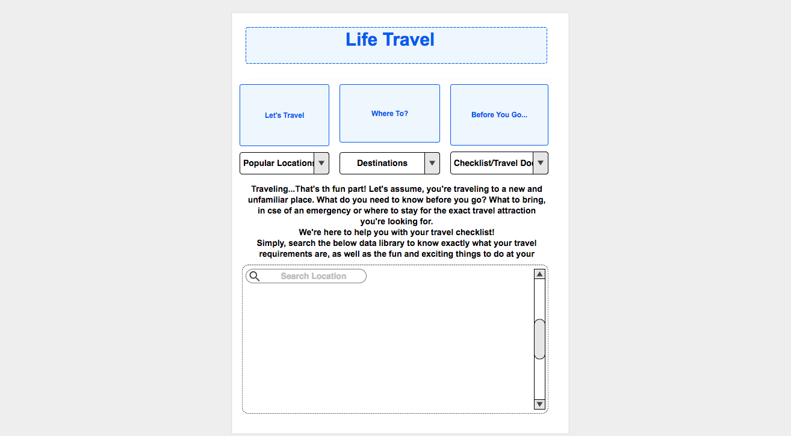

# lifeTravel

**lifeTravel:** Organized & Simple

**Team:** Juanita Pinkney-Barrier, Keli Chau, Summiyah Siddeeq, & Michelle Johnson.

**Overview:** LifeTravel is a web application that allows the user to research a location and obtain important data right on their screen. The application will show ticket information, hotels, weather, immunizations required/health data. App will be fully functional for mobile.

**API's:** [Skyscanner API](https://partners.skyscanner.net/affiliates/travel-apis/), [Center for Disease Control API](https://tools.cdc.gov/syndication/api.aspx#feedoverview), & [Weather Channel API](https://www.programmableweb.com/api/weather-channel)

**Rough Breakdown of Tasks: 
**

Theme: Travel

* API's
* Skyscanner API
* WeatherChannel API
* Center of Disease Control (CDC) API

Content:

* Travel Information: Where to, flight prices, hotels etc.
* Travel Preparation Checklist
* Required Immunzations for destination selected
* Digital Immunzations Records * stretch goals
* Safety Information * stretch goals

UI/UX Design Phase:

* Images
* Complete layout/style of pages
* Input Panels
* Submit Buttons

Wireframes:

* Bootstrap 
* Material Design

Coding Phase:

* HTML/CSS
* Ajax
* Query API
* Buttons
* Persistance

	
Visual Mockup: 

